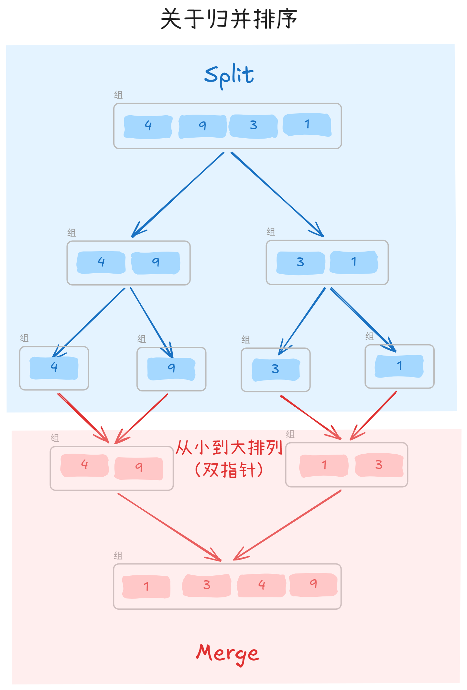
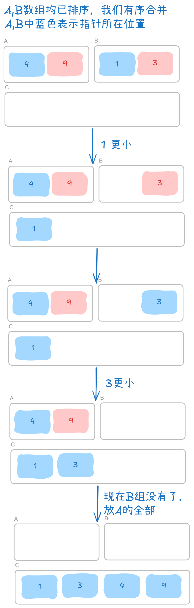

## 思路

1. 分而治之
2. 分/和

先
拆分：递归二分

然后
合并：双指针算法（前提：两个数组已经排序）

## 图解

归并排序



有序合并



## 最终代码

```cpp
#include<bits/stdc++.h>
using namespace std;

int a[100], b[100]; // a 为待排序，b 为临时数组

void msort(int l, int r){
	if(l >= r) return; // 单一元素，不排序
	
	// 拆分
	int mid = (l + r) / 2;
	msort(l, mid); // 继续拆左边
	msort(mid + 1, r); // 右边
	
	// 重排合并
	int lptr = l, rptr = mid + 1, k = l; // 左右指针，当前塞入索引（类似append）
	while(lptr <= mid && rptr <= r){ // 如果左右两边都有东西可比较
		// 如果现在左边的最小值更小，塞入左边最小，然后增加塞入索引
		if(a[lptr] <= a[rptr]){ 
			b[k] = a[lptr];
			k++;
			lptr++;
		}
		// 如果现在右边的最小值更小，塞入右边最小，然后增加塞入索引
		else{
			b[k] = a[rptr];
			k++;
			rptr++;
		}
	}
	
	// 此时有一半没有东西了，直接塞另一个
	while(lptr <= mid){
		b[k] = a[lptr];
		k++;
		lptr++;
	}
	while(rptr <= r){
		b[k] = a[rptr];
		k++;
		rptr++;
	}
	
	for(int i = 1; i <= r; i++)  a[i] = b[i]; // 把临时塞入原本
}

int main(){
	int n;
	cin >> n;
	for(int i = 1; i <= n; i++) cin >> a[i];
	msort(1, n); 
	for(int i = 1; i <= n; i++) cout << a[i] << " ";
	return 0;
}
```

