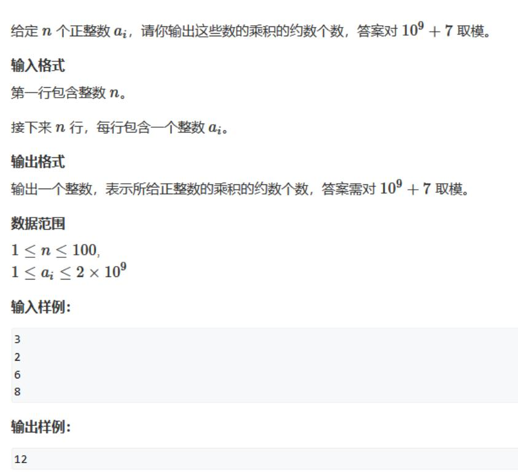
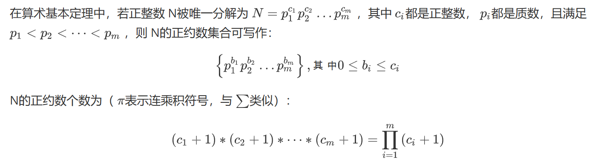
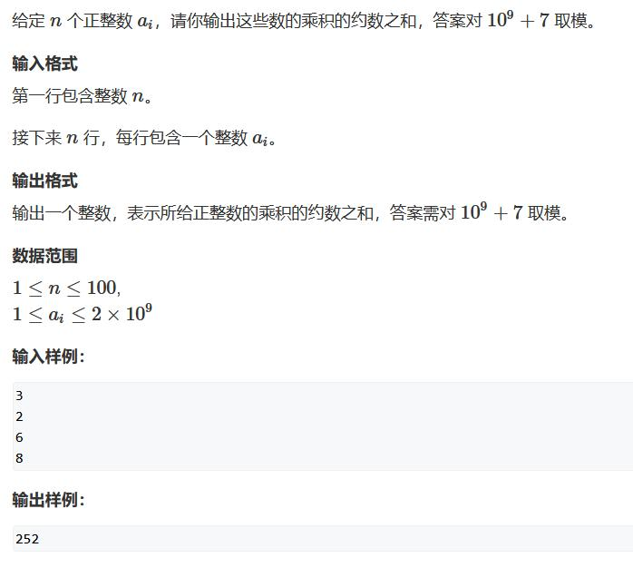
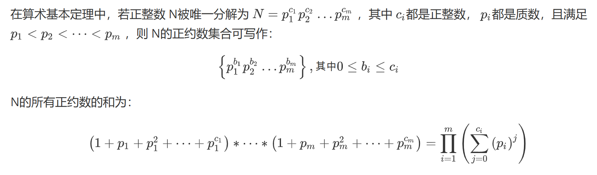
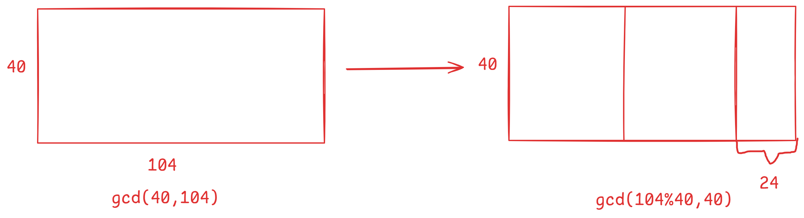
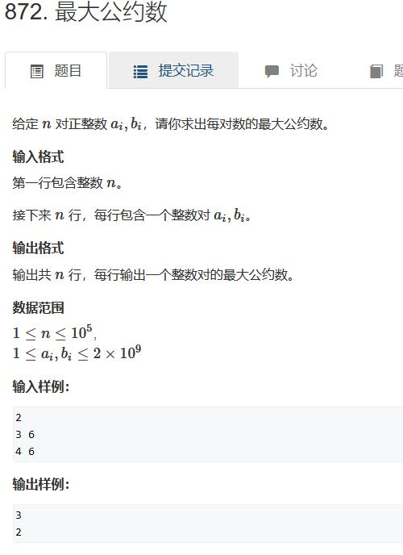
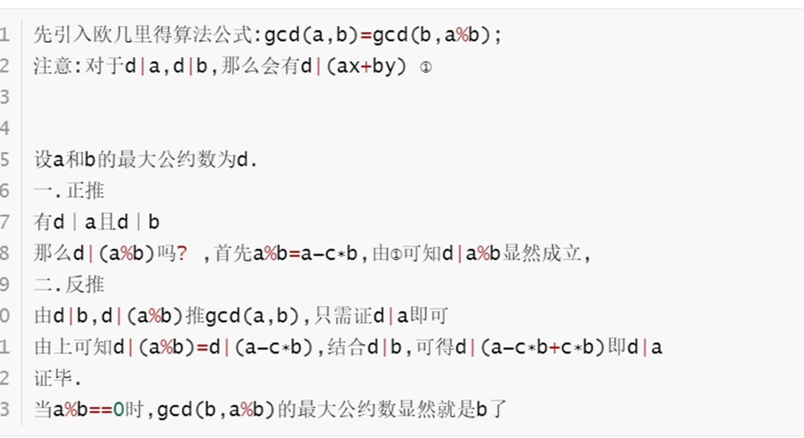

约数。。。

## 约数个数

我们先从一道简单的例题开始吧



需要知道的数学知识：



参考代码：

```cpp
#include<iostream>
#include<unordered_map>
using namespace std;
const int MAGIC_NUMBER = 1e9 + 7;
int main(){
    int n, x;
    unordered_map<int, int> p; // p[j] = i 表示 j 这个质因数的次数为 i
    cin >> n;
    while(n--){
        cin >> x;
        int tmp = x;
        for(int i = 2; i <= tmp / i; i++){
            while(x % i == 0){
                x /= i;
                p[i]++;
            }
        }
        if(x > 1) p[x]++;
    } 
    long long res = 1;
    for(auto it : p){
        res = res * (it.second + 1) % MAGIC_NUMBER;
    }
    cout << res;
    return 0;
}

```

## 约数之和

依旧是一道例题：



这题也有相关数学知识：



这个公式要怎么证明呢，答案是展开就可以了，会发现就是所有约数组合之和

参考代码：

```cpp
#include<iostream>
#include<unordered_map>
using namespace std;
const int MAGIC_NUMBER = 1e9 + 7;
int main(){
    // 质因数分解与上一问完全一样 
    int n, x;
    unordered_map<int, int> p; // p[j] = i 表示 j 这个质因数的次数为 i
    cin >> n;
    while(n--){
        cin >> x;
        int tmp = x;
        for(int i = 2; i <= tmp / i; i++){
            while(x % i == 0){
                x /= i;
                p[i]++;
            }
        }
        if(x > 1) p[x]++;
    } 

    long long res = 1;

    for(auto it : p){
        long long a = it.first;
        long long b = it.second; // 次数
        long long t = 1; // 本轮答案（也就是公式里面的一个括号） 
        while(b--){
            // 可能会对这个有疑惑
            // 可以模拟一下
            // 第一次：t = a + 1
            // 第二次：t = a^2 + a + 1
            // 看懂了吧 
            // 最高次最终会等于 b 
            t = (t * a + 1) % MAGIC_NUMBER;
        }
        res = res * t % MAGIC_NUMBER;
    }
    cout << res;
    return 0;
}
```

## 欧几里得算法

不错的图：



例题：



参考代码：

```cpp
#include<iostream>
using namespace std;
int gcd(int a, int b){
    if(a % b == 0) return b;
    return gcd(b, a % b);
}
int main(){
    int n;
    cin >> n;
    while(n--){
        int a, b;
        cin >> a >> b;
        cout << gcd(a, b) << endl;
    }
    return 0;
}

```

实际上它还有一个更严谨的证明：


