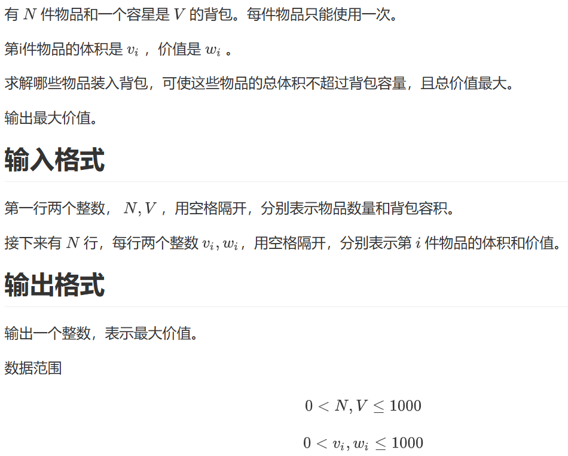
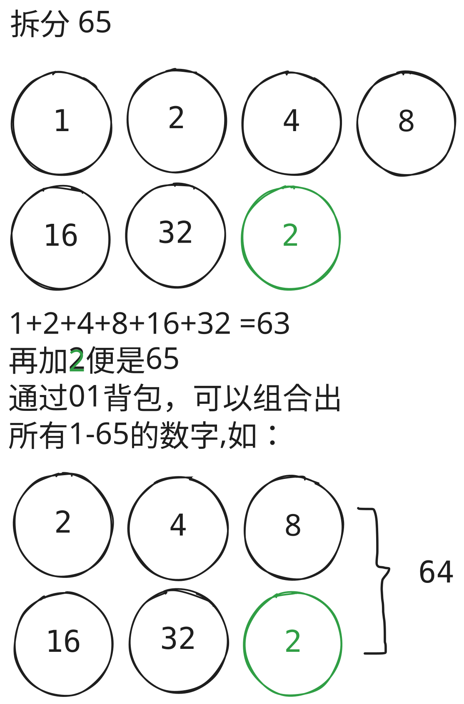

DP 也称为动态规划，其包含状态和转移方程两部分。

DP 的状态具有以下两个特性：

- 最优子结构：它可以把大问题转换为小问题。
- 无后效性：我们只关心子问题的最优值，但是不关心，也不知道他是怎么来的。

DP 的转移方程的核心思想就是分类讨论了。

我就写到这里，接下来热烈欢迎 `Claude` 老师！

## 01 背包



### 题意

> N 件物品，每件只能用一次，体积 v[i]、价值 w[i]，背包容量 V。求能装的最大价值。

数据范围：N, V ≤ 1000，v[i], w[i] ≤ 1000。

### 思路

- **维度 1（物品）**：考虑前 i 个物品里选不选。
- **维度 2（容量）**：当前用了 j 的体积。
- **状态**：`f[i][j]` = 从前 i 个物品中选，总体积不超过 j，最大价值。
- **转移**：第 i 个物品选或不选。
  - 不选：`f[i-1][j]`
  - 选：`f[i-1][j - v[i]] + w[i]`，前提 `j >= v[i]`

```
f[i][j] = max(f[i-1][j], f[i-1][j - v[i]] + w[i])
```

### 二维代码

```cpp
#include <iostream>
using namespace std;

struct Item{
    int v;
    int w;
} items[1010];

// 默认值 0，可以接受
int dp[1010][1010]; // dp[i][j] 考虑前 i 件物品，用 j 体积的最大价值

int main(){
    int n, V;
    cin >> n >> V;
    for(int i = 1; i <= n; i++){
        cin >> items[i].v >> items[i].w;
    }
    for(int i = 1; i <= n; i++){
        for(int j = 1; j <= V; j++){
            dp[i][j] = dp[i-1][j]; // 不选第 i 件
            if(j >= items[i].v){
                dp[i][j] = max(dp[i][j], dp[i-1][j - items[i].v] + items[i].w);
            }
        }
    }
    cout << dp[n][V];
}
```

### 重点：怎么从二维优化到一维

**关键观察**：算第 i 层时，只用到了第 i−1 层。第 i−2、i−3、… 层都扔了——完全可以滚掉一维。

把 `dp[i][j]` 改写成 `dp[j]`，含义是"当前这一层（i 这一层）的 dp 值"。

**问题来了**：两层能压成一维吗？如果 j 循环还是**正序**，会出错：

> 假设 `v[i] = 2`。当 `j = 4` 时，`dp[4]` 要用 `dp[4 - 2] = dp[2]`。
> 但 `dp[2]` 在 j = 2 那一轮**已经被本层更新过了**，相当于把第 i 件物品选了两遍！
> 这就违反了 01 背包"每件只能用一次"的规则。

**正确做法**：让 j **倒序**遍历。

倒序时，`dp[4]` 更新用到的是 `dp[2]`，而 `dp[2]` 这一轮还没被更新（要等 j 走到 2 才更新 `dp[2]`），所以读到的是 i−1 层的旧值，符合"只用一次"。

> 口诀：**01 背包倒着来，完全背包正着来**。

### 一维代码

```cpp
#include <iostream>
using namespace std;

struct Item{
    int v;
    int w;
} items[1010];

int dp[1010]; // dp[j] 体积不超过 j 的最大价值，滚动数组

int main(){
    int n, V;
    cin >> n >> V;
    for(int i = 1; i <= n; i++){
        cin >> items[i].v >> items[i].w;
    }
    for(int i = 1; i <= n; i++){
        // 倒序！保证每个物品只被加一次
        for(int j = V; j >= items[i].v; j--){
            dp[j] = max(dp[j], dp[j - items[i].v] + items[i].w);
        }
    }
    cout << dp[V];
}
```

### 易错点

- `dp` 数组要清零（全局数组默认 0，可以接受，因为不装就是 0）。
- j 循环必须从 V 倒到 v[i]，不是从 0 倒到 v[i]——倒着遍历是为了一次性排除"已经被本层更新过的 dp 值"，循环上界仍然是 V。
- `dp[n][V]` 写成 `dp[V]`（滚动后输出就是当前层的）。

---

## 完全背包

### 题意

> N 种物品，每种**无限件**，体积 v[i]、价值 w[i]，背包容量 V。求最大价值。

### 朴素思路（三重循环）

状态、转移思路和 01 背包几乎一样，区别在于第 i 种可以选 0, 1, 2, …, k 件（k ≤ j / v[i]）。

```
f[i][j] = max(f[i-1][j - k*v[i]] + k*w[i])    // 0 <= k <= j/v[i]
```

### 二维三重循环代码

```cpp
#include <iostream>
using namespace std;

struct Item{
    int v;
    int w;
} items[1010];

int dp[1010][1010];

int main(){
    int n, V;
    cin >> n >> V;
    for(int i = 1; i <= n; i++){
        cin >> items[i].v >> items[i].w;
    }
    for(int i = 1; i <= n; i++){
        for(int j = 0; j <= V; j++){
            for(int k = 0; k * items[i].v <= j; k++){
                // 选 k 件第 i 种物品
                dp[i][j] = max(dp[i][j], dp[i-1][j - k*items[i].v] + k*items[i].w);
            }
        }
    }
    cout << dp[n][V];
}
```

### 重点：三重的二维优化到二重（推导）

把展开式写出来对比一下 01 背包：

> ```
> f[i][j]    = Max( f[i-1][j],                  f[i-1][j-v]+w,    f[i-1][j-2v]+2w,  ... )
> f[i][j-v]  = Max(        f[i-1][j-v],         f[i-1][j-2v]+w,    f[i-1][j-3v]+2w, ... )
> ```

下面一行整体 +w 就是上面第二项开始的所有项。所以：

```
f[i][j] = max(f[i-1][j], f[i][j-v[i]] + w[i])
```

**注意**：右边是 `f[i][j-v[i]]`（同层），不是 `f[i-1][j-v[i]]`（上一层）。这和 01 背包**只差一个下标**。

这意味着选第 i 种物品的次数没有上限，可以一直"在自己的层里"反复加 w[i]。

### 与 01 背包的对比


| 背包类型 | 转移方程（不选 + 选） |
| ----- | ------------------------------------------- |
| 01 背包 | `f[i][j] = max(f[i-1][j], f[i-1][j-v] + w)` |
| 完全背包 | `f[i][j] = max(f[i-1][j], f[i][j-v] + w)` |


下标从 i−1 变成 i——这一字之差，就是"每件只能用一次"和"无限件"的本质区别。

### 二维二重循环代码（已经够用）

```cpp
#include <iostream>
using namespace std;

struct Item{
    int v;
    int w;
} items[1010];

int dp[1010][1010];

int main(){
    int n, V;
    cin >> n >> V;
    for(int i = 1; i <= n; i++){
        cin >> items[i].v >> items[i].w;
    }
    for(int i = 1; i <= n; i++){
        for(int j = 0; j <= V; j++){
            dp[i][j] = dp[i-1][j]; // 不选
            if(j >= items[i].v){
                // 这里的 dp[i] 是同层！相当于再加一件
                dp[i][j] = max(dp[i][j], dp[i][j - items[i].v] + items[i].w);
            }
        }
    }
    cout << dp[n][V];
}
```

### 重点：完全背包的一维优化为什么是正序？

压成 `dp[j]` 后，转移变成：

```
dp[j] = max(dp[j], dp[j - v[i]] + w[i])
```

"同层"的 `dp[j-v[i]]` 在我们这一轮 j 循环里已经被更新过了——这正是我们想要的（无限件，每件可选多次）。

所以 j 必须**正序**：从小到大遍历 `dp[j-v[i]]` 已经是本层更新过的值，可以无限加 w[i]。

### 完全背包一维代码

```cpp
#include <iostream>
using namespace std;

struct Item{
    int v;
    int w;
} items[1010];

int dp[1010];

int main(){
    int n, V;
    cin >> n >> V;
    for(int i = 1; i <= n; i++){
        cin >> items[i].v >> items[i].w;
    }
    for(int i = 1; i <= n; i++){
        // 正序！允许重复选第 i 种
        for(int j = items[i].v; j <= V; j++){
            dp[j] = max(dp[j], dp[j - items[i].v] + items[i].w);
        }
    }
    cout << dp[V];
}
```

### 易错点

- 不要把"完全背包一维"误写成"01 背包一维"——会少选/重选。
- 时间复杂度是 O(NV)，N, V ≤ 1000 时够用。

---

## 多重背包

### 题意

> N 种物品，第 i 种最多有 s[i] 件，每件体积 v[i]、价值 w[i]，背包容量 V。

它介于 01 和完全之间：s[i] = 1 就是 01 背包，s[i] = ∞ 就是完全背包。

### 朴素思路

状态不变：`f[i][j]`。转移时第 i 种物品选 k 件（0 ≤ k ≤ s[i]）。

```
f[i][j] = max(f[i-1][j - k*v[i]] + k*w[i])    // 0 <= k <= s[i] 且 k*v[i] <= j
```

### 二维代码

```cpp
#include <iostream>
using namespace std;

struct Item{
    int v;
    int w;
    int s; // 数量上限
} items[110];

int dp[110][110]; // 课件数据范围 N, V <= 100

int main(){
    int n, V;
    cin >> n >> V;
    for(int i = 1; i <= n; i++){
        cin >> items[i].v >> items[i].w >> items[i].s;
    }
    for(int i = 1; i <= n; i++){
        for(int j = 0; j <= V; j++){
            // 第 i 种选 k 件
            for(int k = 0; k <= items[i].s && k * items[i].v <= j; k++){
                dp[i][j] = max(dp[i][j], dp[i-1][j - k*items[i].v] + k*items[i].w);
            }
        }
    }
    cout << dp[n][V];
}
```

### 问题：朴素版太慢

N, s ≤ 2000 时朴素是 O(N · V · s)，容易超时。

### 重点：二进制拆分优化

**思路**：把 s 件拆成几"捆"，每捆要么全选要么不选（变成 01 背包）。

比如 s = 13，按二进制拆成 1 + 2 + 4 + 6：

- 选 1：得到 1 件
- 选 2：得到 2 件
- 选 1+2：得到 3 件
- 选 4：得到 4 件
- 选 1+4：得到 5 件
- 选 2+4：得到 6 件
- 选 1+2+4：得到 7 件
- 选 6：得到 6 件
- 选 1+6：得到 7 件
- 选 2+6：得到 8 件
- …
- 选 1+2+4+6：得到 13 件

1, 2, 4, …, 2^k, 剩下的余数——加起来能凑出 [1, 13] 的所有整数。

**为什么能凑出所有整数？** 任一整数 x 都可以写成二进制，而拆出来的捆正好对应二进制的每一位（或余数）。

一般规则：

```
k = 1;
while(k <= s){
    把 k 件打成一捆；(v' = k*v, w' = k*w)
    s -= k;
    k *= 2;
}
if(s > 0){
    把剩下的 s 件再打成一捆；(v' = s*v, w' = s*w)
}
```

这样 s 件就被拆成了 **O(log s)** 捆。然后用 01 背包跑一遍。



### 二进制优化代码

```cpp
#include <iostream>
using namespace std;

const int N = 12010, M = 2010;
// N = 1000 * log2(2000) ≈ 11000，留大点
int v[N], w[N];
int dp[M];

int main(){
    int n, V;
    cin >> n >> V;
    int cnt = 0;
    for(int i = 1; i <= n; i++){
        int a, b, s;
        cin >> a >> b >> s;
        int k = 1;
        // 拆分：1, 2, 4, 8, ..., 余数
        while(k <= s){
            cnt++;
            v[cnt] = a * k;
            w[cnt] = b * k;
            s -= k;
            k *= 2;
        }
        if(s > 0){
            cnt++; // 剩下的余数打成一捆
            v[cnt] = a * s;
            w[cnt] = b * s;
        }
    }
    // 拆完后变成 cnt 件物品的 01 背包
    for(int i = 1; i <= cnt; i++){
        for(int j = V; j >= v[i]; j--){
            dp[j] = max(dp[j], dp[j - v[i]] + w[i]);
        }
    }
    cout << dp[V];
}
```

### 易错点

- 拆分时 `v[cnt] = a * k`，不是 `a`——一捆里的总件数要乘进去。
- `cnt` 上界估算：N · log₂(max s)。N = 1000, s ≤ 2000 时大约 11000，数组开 12010 足够。
- 完全背包用 `n` 还是 `cnt`？循环次数用 `cnt`，因为拆分后物品总数变了。

---

## 分组背包

### 题意

> N 组物品，背包容量 V。**同一组内的物品最多只能选一个**（可以不选）。第 i 组有 s[i] 个物品，第 k 个体积 v[i][k]、价值 w[i][k]。求最大价值。


### 状态定义

`f[i][j]` = 只从前 i 组物品中选，总体积不超过 j，最大价值。

注意：状态维度是"组"而不是"物品"。

### 重点：为什么一组内最多选一个？

把"组"当成一个整体来决策。处理到第 i 组时，有 s[i] + 1 种选法：

- **整组不选** → 价值 = `f[i-1][j]`
- **选组内的第 1 件** → 价值 = `f[i-1][j - v[i][1]] + w[i][1]`
- **选组内的第 2 件** → 价值 = `f[i-1][j - v[i][2]] + w[i][2]`
- …
- **选组内的第 s[i] 件** → 价值 = `f[i-1][j - v[i][s[i]]] + w[i][s[i]]`

`s[i] + 1` 种里面挑一个 max，自然就保证"一组内最多选一个"——因为我们根本没写"选两件"这种选项。

> **本质**：把"决策单元"从单个物品升级成一组，对每组做一次"组级决策"，决策结果是不选或选组内的某一个。这就是为什么不能用"枚举每件选/不选"——那样会选到同一组的两件。

### 转移方程

```
f[i][j] = max(
    f[i-1][j],                                            // 整组不选
    f[i-1][j - v[i][1]] + w[i][1],                        // 选组内第 1 个
    f[i-1][j - v[i][2]] + w[i][2],                        // 选组内第 2 个
    ...
    f[i-1][j - v[i][s[i]]] + w[i][s[i]]                   // 选组内最后一个
)
```

实现里用一个 for 循环遍历组内所有 k：

```
f[i][j] = f[i-1][j];
for(k = 1; k <= s[i]; k++){
    if(j >= v[i][k]){
        f[i][j] = max(f[i][j], f[i-1][j - v[i][k]] + w[i][k]);
    }
}
```

### 二维代码

```cpp
#include <iostream>
using namespace std;

const int N = 110;
int v[N][N], w[N][N], s[N]; // s[i] 第 i 组物品数
int dp[N][N];

int main(){
    int n, V;
    cin >> n >> V;
    for(int i = 1; i <= n; i++){
        cin >> s[i];
        for(int k = 1; k <= s[i]; k++){
            cin >> v[i][k] >> w[i][k];
        }
    }
    for(int i = 1; i <= n; i++){
        for(int j = 0; j <= V; j++){
            dp[i][j] = dp[i-1][j]; // 整组不选
            for(int k = 1; k <= s[i]; k++){
                if(j >= v[i][k]){
                    // 每件最多选一次：来源是上一层
                    dp[i][j] = max(dp[i][j], dp[i-1][j - v[i][k]] + w[i][k]);
                }
            }
        }
    }
    cout << dp[n][V];
}
```

### 一维优化

和一维 01 背包几乎一样——因为转移只用到了上一层 `dp[i-1][?]`。

```
f[j] = f[j];
for(k = 1; k <= s[i]; k++){
    if(j >= v[i][k]){
        f[j] = max(f[j], f[j - v[i][k]] + w[i][k]);
    }
}
```

**关键**：j 循环必须**倒序**，因为每次更新 `f[j]` 用的是 `f[j - v[i][k]]`，要保证它是上一层的旧值（这一组内的物品只能选一个）。

```cpp
#include <iostream>
using namespace std;

const int N = 110;
int v[N][N], w[N][N], s[N];
int dp[N];

int main(){
    int n, V;
    cin >> n >> V;
    for(int i = 1; i <= n; i++){
        cin >> s[i];
        for(int k = 1; k <= s[i]; k++){
            cin >> v[i][k] >> w[i][k];
        }
    }
    for(int i = 1; i <= n; i++){
        // 倒序：每个组内的物品最多选一个
        for(int j = V; j >= 0; j--){
            for(int k = 1; k <= s[i]; k++){
                if(j >= v[i][k]){
                    dp[j] = max(dp[j], dp[j - v[i][k]] + w[i][k]);
                }
            }
        }
    }
    cout << dp[V];
}
```

### 易错点

- 内层 k 循环遍历的是"组内的每件物品"，不是"每件物品"——别把它和多重背包的 k 混淆。多重背包里 k 是件数，分组背包里 k 是"组内编号"。
- 一维优化的倒序只对 j 起作用，**组内物品的 k 循环正常**。你不需要为组内顺序担心——因为同一件物品只会被用一次（不像完全背包要让 k 可以累积）。
- 千万不要把分组背包写成"对每件物品跑 01 背包"——那样会选到同一组的两件。

---

## 五种背包对比表


| 类型 | 转移方程（二维） | 一维 j 循环方向 | 备注 |
| ----- | ------------------------------------------------------- | --------- | ------ |
| 01 背包 | `f[i][j] = max(f[i-1][j], f[i-1][j-v] + w)` | 倒序 | 每件用一次 |
| 完全背包 | `f[i][j] = max(f[i-1][j], f[i][j-v] + w)` | 正序 | 无限件 |
| 多重背包 | `f[i][j] = max(f[i-1][j-kv] + kw)`，k ∈ [0, s] | 二进制拆分后倒序 | 件数有限 |
| 分组背包 | `f[i][j] = max(f[i-1][j], f[i-1][j-v[i][k]] + w[i][k])` | 倒序 | 组内最多一个 |


> 口诀：**01、分组倒序；完全正序；多重先拆再 01**。

---

## 易错点汇总

1. **下标越界**：转移前一定要 `if(j >= v[i])`，特别是 `j - v[i]` 可能为负。
2. **数组清零**：全局变量默认 0 通常够用（最大价值 ≥ 0）。如果题目要"恰好装满"就得初始化为 −∞，再把 `dp[0] = 0`。
3. **循环边界**：j 是从 0 开始还是 1 开始无所谓，但要保持一致。
4. **倒序写错**：01 背包把 `j >= v[i]` 写成 `j >= 0` 会导致数组越界。
5. **二进制拆分遗漏余数**：记得处理 `s -= k` 之后剩下的部分。
6. **分组背包和多重背包混淆**：k 循环含义不同——多重背包是"件数"，分组背包是"组内编号"。

