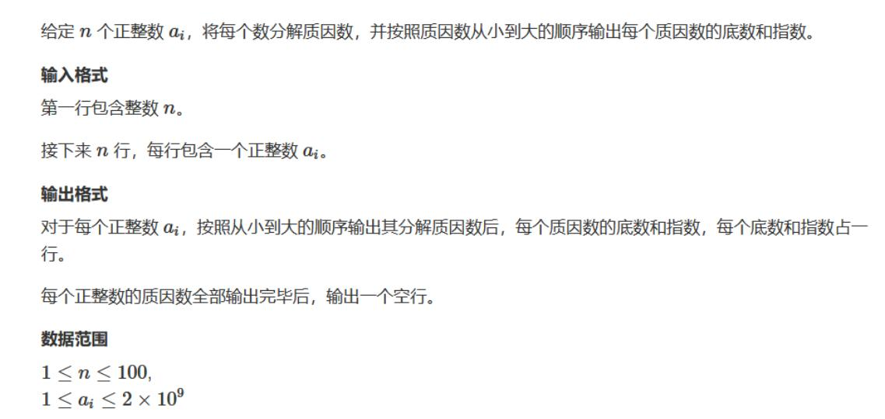
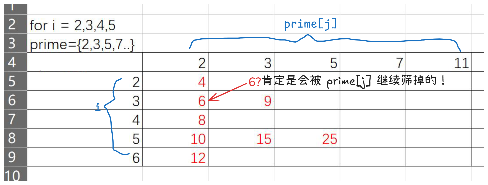

我们先从例题开始：



需要知道的：

> 算术基本定理：任何一个大于 1 的自然数可以分解成一些质数的乘积。且表示方式唯一。  
> 对于一个 n，只有一个质因数大于 `sqrt(n)`，否则乘起来就大于 `n` 了

代码：

```cpp
#include<iostream>
using namespace std;

int main(){
	int n;
	cin >> n;
	for(int I = 1; I <= n; I++){
		int a;
		cin >> a;
		int tmp = a;
		// 寻找质因数 
		for(int i = 2; i <= tmp / i; i++){
			// 用了一个时间差，这里 i 一定是质因数，合数要干的已经被更小的质数除了 
			if(a % i == 0){
				int p = 0; // 指数
				while(a % i == 0){
					a /= i;
					p++;
				} 
				cout << i << " " << p << endl;
			}
		}
		
		// 现在我们已经全部除完
		// 剩下只有两种情况，至于为什么请参考算数基本定理 
		// 1. 除干净了，只剩下一个 1
		// 2. 还剩一个大于 sqrt a 的质因数 
		if(a > 1) cout << a << " " << 1 << endl;
		cout << endl;
	}
	return 0;
}
```

接下来我们来看看如何高效统计 `1-n` 的所有质数数量：

```cpp
// 埃氏筛
// 比起普通的因数筛，埃氏筛使用了 
// 任何一个大于 1 的自然数可以分解成一些质数的乘积
// 这条规则，这使得它的速度大幅增加，因为不再需要统计大量合数因子

#include<iostream>
using namespace std;

const int M = 1e5 + 10;
bool is_comp[M]; // is_comp[i] = 数字 i 是合数吗 
int prime[M]; // 储存质数
int cnt = 0; // 质数数量 

int n;

void find_prime(){
	// 注意我们此刻需要找到所有质数，不能 sqrt 半途退出，如果疑惑 21 会是个不错的例子 
	for(int i = 2; i <= n; i++){
		if(is_comp[i] == false){
			prime[cnt++] = i;
			for(int j = i * 2; j <= n; j += i){
				is_comp[j] = true;
			}
		}
	}
}

int main(){
	cin >> n;
	find_prime();
	cout << cnt;
} 

// 总的来说，其复杂度为 O(nloglogn) 

```

能不能更快呢？

```cpp
// 线性筛
// 埃氏筛最大的问题是，像 6 这样的合数，会被质数 2 和 3，两次统计，对于有些数，甚至更多
// 我们希望每个合数只被筛一次

#include<iostream>
using namespace std;

const int M = 1e6 + 10;
bool is_comp[M];
int prime[M];
int cnt = 0;

int n;

void find_prime(){
	for(int i = 2; i <= n; i++){ 
		// 纪录质数 
		if(is_comp[i] == false){
			prime[cnt++] = i; 
		}
		
		// 这个限制也就是 prime[j] * i <= n，显然如果大于就不符合题意了 
		// 我们寻找 i 的最小质因数 
		for(int j = 0; prime[j] <= n / i; j++){
			// 标记每一个访问过的合数 
			is_comp[prime[j] * i] = true;
			// 如果 i % prime[j] == 0
			// 那么 i 其实已经被 prime[j] 筛过了！
			// 我们的遍历顺序决定了 prime[] 里面的内容是从小到大的
			// 所以 i 乘上后面的质数还有一个因子 i
			// 且 prime[更后面 ] * i > prime[j]
			// 肯定是会被 prime[j] 继续筛掉的！
			// 那我们就不多余统计了 
			if(i % prime[j] == 0) break; 
		}
	}
}

int main(){
	cin >> n;
	find_prime();
	cout << cnt;
	return 0;
} 

// 此刻复杂度 O(n)
```

线性筛实际上有点困难，如果不理解，可以看这张图



~~真是疯狂啊~~